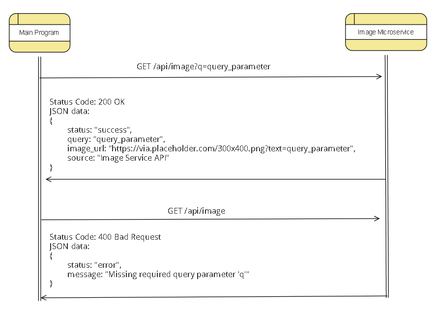

# Purpose of this Microservice
This microservice returns an image URL based on a query string.

## Extra information about the microservice
If the query has no errors, the status code it returns with the image URL is 200.
However, if there is an error, the status code will be 400.
Also, a developer can check if the service is availble through the root route "/"

Note, this microservice listens on port 5001.

# How to REQUEST data from the microservice
In order to request data from the microservice, the developer needs to send a HTTP GET request to the endpoint "/api/image" with a query. An example enpoint is `/api/image?q=image_to_search` where `image_to_search` will be the name of the image (ex. puppy123).

## Example REQUEST in JavaScript using fetch()
For this example, we will assume that you are running this microservice in the same computer as the program that will be requesting the image URL. For this example, we will use `fetch()`.

Here is an example where we want the image URL of puppy123:
`const response = await fetch('http://localhost:5001/api/image?q=puppy123');`

We recommend that you actually do:
`const imageName = "puppy123";`
`const response = await fetch(`http://localhost:5001/api/image?q=${endcodedURIComponent(imageName)}`);`
This is because if the name of the image has special characters such as spaces, it will cause an error.
So please use `encodedURIComponent()`.

# How to RECEIVE data from the microservice using json()
At this step, we assume you made the same call as the example shown above. 

If successful we should expect a status code of 200. The variable `response` should have the response from the microservice. In order to extract the JSON from the response, we will use `json()`.

Here is an example where we want to get the JSON data from the response:
`const jsonData = await response.json();`

We expect the variable `jsonData` to hold the following data:
`{status: "success", query: "puppy123",  image_url: "https://via.placeholder.com/300x400.png?text=puppy123", source: "Image Service API"}` 

If the request was not successful due to missing query parameter, you should expect a status code of 400 from the response and a data of:
`{status: "error", message: "Missing required query parameter 'q'"}`

# UML Sequence Diagram

